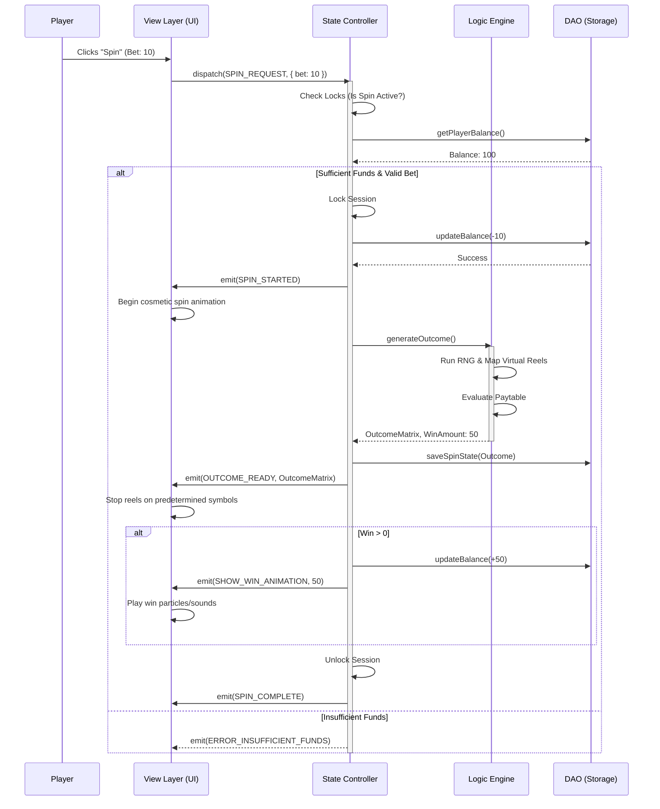

# Frontend Architecture Design Document

## 1. Introduction & Architectural Goals

This document defines the technical implementation strategy and frontend architecture for the Slot Machine project. The primary goal is to establish a robust, scalable, and secure foundation that adheres strictly to domain principles (RNG integrity, RTP math models, and decoupled architecture).

The core architectural tenets are:
*   **Module Decoupling:** Clear, impenetrable boundaries separating the Math/Logic Engine, the State Controller, and the View/Animation Layer.
*   **Database-Ready (Local-First):** The application currently operates in a stateless, local-first mode using a Data Access Object (DAO) layer. This layer abstracts storage operations, allowing a future transition from `localStorage` to a remote Database (REST/GraphQL API) with zero modifications required within the UI components.
*   **Simulated Security Boundaries:** Even within a local-first environment, the frontend architecture will simulate client-server trust boundaries, ensuring that the UI never dictates game outcomes and state modifications are protected against simulated concurrency issues.

## 2. System Architecture Overview

The system employs a strict separation of concerns, mimicking a secure client-server model entirely within the frontend application for the initial phase.

```mermaid
graph TD
    subgraph View / Animation Layer (The "Client")
        UI[User Interface Components]
        ANIM[Animation & Asset Manager]
        INPUT[Input Handlers]
    end

    subgraph State Controller (The "Middleware")
        SM[Session & Wallet Manager]
        VAL[Input Validation & Locks]
    end

    subgraph Math / Logic Engine (The "Virtual Server")
        RNG[Random Number Generator]
        REELS[Virtual Reels & Weights]
        PAY[Paytable Evaluator]
    end

    subgraph Data Access Object Layer (DAO)
        INTERFACE[Storage Interface]
        LOCAL[localStorage Adapter]
        REMOTE[Future REST/GraphQL Adapter]
    end

    INPUT -->|Spin Request| VAL
    VAL -->|Valid Wager| SM
    SM -->|Deduct Bet| INTERFACE
    SM -->|Request Outcome| RNG
    RNG -->|Generated Numbers| REELS
    REELS -->|Symbols Matrix| PAY
    PAY -->|Win/Loss Result| SM
    SM -->|Update Balance| INTERFACE
    SM -->|Final Outcome Data| ANIM
    ANIM -->|Visual Playback| UI
    
    INTERFACE -.-> LOCAL
    INTERFACE -.-> REMOTE
```

## 3. Core Modules & Decoupling Boundaries

### 3.1 Math/Logic Engine (Virtual Server)
This module acts as the impenetrable "brain" of the game. It is completely unaware of the DOM, animations, or user timing.
*   **RNG & Instantaneous Resolution:** Upon receiving a valid spin request, the engine instantaneously generates the final outcome matrix. It does not "spin"; it simply computes.
*   **Symbol Weighting & Virtual Reels:** The engine utilizes configured probability tables (Virtual Reels). It maps RNG outputs to specific symbols based on predefined weights, controlling the Hit Frequency and enabling varied Volatility (e.g., heavily weighting low-value symbols while making jackpot triggers rare).
*   **Paytable & RTP Mechanics:** The engine evaluates the generated symbol matrix against the Paytable to determine wins, multipliers, and feature triggers. The combination of the Virtual Reels and Paytable defines the theoretical Return to Player (RTP).

### 3.2 State Controller (Session & Wallet Management)
This module manages the player's session, acting as the gatekeeper between the UI and the Logic Engine.
*   **State Validation & Trust Boundaries:** It treats all input from the View Layer as untrusted. It validates wager amounts against allowed tiers and cross-references them with the authoritative balance stored via the DAO.
*   **Concurrency Control (Simulated):** To prevent race conditions (e.g., rapid-fire spin clicks), the controller implements a locking mechanism. When a spin initiates, the wallet state is locked until the spin fully resolves.
*   **Idempotency & Recovery:** Every spin is assigned a unique Spin ID. The controller persists the current phase of the spin (e.g., `BET_DEDUCTED`, `OUTCOME_GENERATED`, `PAYOUT_COMPLETED`) to allow graceful recovery in case of simulated network drops or browser reloads.

### 3.3 View/Animation Layer (UI)
The View Layer is strictly a "dumb" terminal responsible for user engagement.
*   **Cosmetic Playback:** It receives the *final, pre-calculated outcome* from the State Controller and "plays back" the result through animations. The spinning reels are purely visual theater and have no bearing on the mathematical outcome.
*   **Asset Management:** Handles the loading, caching, and rendering of high-fidelity symbols, backgrounds, and particle effects (the "juice").
*   **Responsive Grid:** Manages the mathematical layout of the 5x3 grid and visualizes active paylines when wins occur.

## 4. Data Access Object (DAO) Layer

To achieve the "Database-Ready" requirement, the application strictly interacts with storage through a standardized interface. UI components and the State Controller never call `localStorage` directly.

### 4.1 Standardized Storage Interface
A TypeScript interface (or equivalent abstraction) defines the required contract:
*   `getPlayerBalance(playerId): number`
*   `updateBalance(playerId, delta, transactionId): boolean`
*   `saveSpinState(spinId, stateData): void`
*   `getRecoverableSpin(playerId): SpinState | null`

### 4.2 Local-First Implementation
The current implementation utilizes a `LocalStorageAdapter` that implements this interface. It serializes state to JSON and handles simulated asynchronous delays (using Promises and `setTimeout`) to mimic network latency. This is crucial for testing the View Layer's loading states and concurrency locks.

### 4.3 Path to Extensibility
When migrating to a real backend, a new `ApiAdapter` (using `fetch` or GraphQL) will be created implementing the exact same interface. By simply swapping the adapter provided to the application at startup (Dependency Injection), the entire UI and State Controller will seamlessly interact with the real database with zero structural code changes.

## 5. Spin Workflow & Event Flow

The spin process follows a strict, sequential transaction model to guarantee state integrity.

### 5.1 Spin Execution Sequence



### 5.2 Key Workflow Phases
1.  **Initialization:** The View requests a spin. The State Controller takes over.
2.  **Validation & Locking:** The controller verifies the bet, locks the session to prevent concurrent requests, and deducts the wager atomically via the DAO.
3.  **Generation:** The Logic Engine instantaneously calculates the result.
4.  **Playback:** The outcome is handed to the View Layer, which orchestrates the timings of the reel stops and win animations based *only* on the provided data.
5.  **Resolution:** Winnings are applied via the DAO, locks are released, and the system readies for the next input.